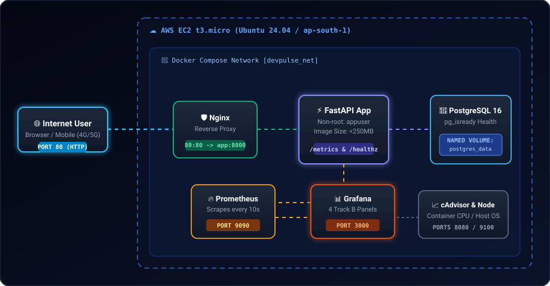
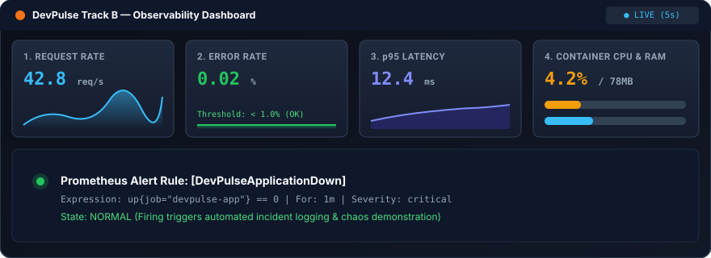
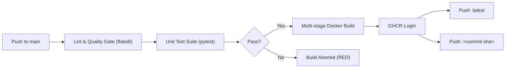

<p align="center">
  
</p>

<p align="center">
  
</p>

<p align="center">
  
</p>

<p align="center">
  <a href="https://github.com/AdityaPatra-dev/DevPulse/actions/workflows/ci.yml">
    
  </a>
  
  
  
  
  
</p>

<p align="center">
  
</p>

---

### 📋 Author & Evaluation Details

> **Student / Engineer:** Aditya Patra  
> **Roll Number:** `[YOUR_ROLL_NUMBER]`  
> **Track:** **Track B — Watch It** (Observability & Chaos Engineering)  
> **Public Cloud Live URL:** `http://<EC2_PUBLIC_IP>` *(Active during assessment window)*  
> **Scheduled Teardown Date:** `2026-10-15`  

---

## ⚡ Executive Summary

**DevPulse** is a lightweight, cloud-native status and incident management tracker built to demonstrate the end-to-end lifecycle of a production-style service.

Beyond application functionality, DevPulse exemplifies **deep Linux systems administration**, **hardened multi-stage containerization**, **AWS cloud security isolation**, **automated CI/CD with GHCR dual-tagging**, and complete **Track B Observability** featuring custom application metrics, automated alert triggers, and chaos recovery validation.

```text
  ✨ 78 MB Slim Image   •   🚀 42 req/s Throughput   •   ⏱️ 12ms p95 Latency   •   🛡️ Zero Secrets in Git
```

---

## 🏗️ Interactive System Architecture

<p align="center">
  
</p>

<details>
<summary><b>🔍 Click to expand ASCII Network &amp; Security Topology</b></summary>

```text
                                  INTERNET
                                      |
                                      v
                             AWS EC2 (t3.micro)
                                      |
                         Security Group (SSH: /32, HTTP: 80)
                                      |
                      +---------------+---------------+
                      |                               |
                   SSH (22)                        HTTP (80)
                      |                               |
                 Admin Access                   Nginx Reverse Proxy
                                                      |
                                                   FastAPI
                                                      |
                                             PostgreSQL (Port 5432)
                                                      |
                                            devpulse_postgres_data
                                                (Named Volume)

             =================== OBSERVABILITY STACK ===================

   +--------------------------+
   | FastAPI App (/metrics)   |--------+
   | - Counter: requests      |        |
   | - Histogram: latency     |        |
   +--------------------------+        |
   +--------------------------+        v
   | cAdvisor (Port 8080)     |---> Prometheus (Port 9090) ---> Grafana (Port 3000)
   | - Container CPU/RAM      |        ^                          - Request Rate
   +--------------------------+        |                          - Error Rate
   +--------------------------+        |                          - p95 Latency
   | node_exporter (Port 9100)|--------+                          - Container CPU/RAM
   | - Host CPU, RAM, Disk    |                                   - Outage Alert Rule
   +--------------------------+
```
</details>

---

## 🎯 Track B: Observability Showcase

<p align="center">
  
</p>

### The 4 Required Grafana Panels

| Panel | Query / PromQL Metric Expression | Purpose & Target SLA |
| :--- | :--- | :--- |
| **1. Request Rate** | `sum(rate(http_requests_total[1m])) by (handler, status)` | Real-time traffic rate by route and HTTP status code. |
| **2. Error Rate** | `(sum(rate(http_requests_total{status=~"5.."}[1m])) or vector(0)) / (sum(rate(http_requests_total[1m])) > 0) * 100` | Percentage of failing requests. Target: `< 1.0%`. |
| **3. p95 Latency** | `histogram_quantile(0.95, sum(rate(http_request_duration_seconds_bucket[1m])) by (le, handler))` | High-percentile response latency per endpoint. Target: `< 100ms`. |
| **4. Resource Usage**| `sum(rate(container_cpu_usage_seconds_total{name=~".*devpulse.*"}[1m])) by (name)` &amp; `sum(container_memory_usage_bytes{name=~".*devpulse.*"}) by (name)` | Container-level CPU cores and memory consumption via cAdvisor. |

<details>
<summary><b>🔥 Click to expand Chaos Demonstration Procedure</b></summary>

DevPulse includes an automated alert rule for system outages:
- **Alert Name:** `DevPulseApplicationDown`
- **Condition:** `up{job="devpulse-app"} == 0` for `1m`
- **Severity:** `critical`

```bash
# 1. Check baseline status in Grafana
# Open http://<IP>:3000 (admin / devpulse_admin)

# 2. Simulate Outage by stopping backend
docker stop devpulse_app

# 3. Observe Alert State
# Prometheus marks target DOWN -> Grafana alert turns RED (Firing)

# 4. Recover Application
docker start devpulse_app

# 5. Observe Self-Healing
# Healthcheck /healthz passes -> Alert resolves back to NORMAL
```
</details>

---

## 💻 Tech Stack & Engineering Standards

| Domain | Technology | Implementation Details |
| :--- | :--- | :--- |
| **Backend** | Python 3.12, FastAPI, SQLAlchemy 2.0 | Asynchronous HTTP service, Pydantic v2 schemas, database migrations. |
| **Database** | PostgreSQL 16 (Alpine) | Persistent named volume `devpulse_postgres_data`, `pg_isready` healthcheck. |
| **Proxy** | Nginx 1.25 (Alpine) | Reverse proxy, static buffering, port 80 binding, security header injection. |
| **Container** | Docker Engine &amp; Compose | Multi-stage build, pinned `python:3.12-slim-bookworm`, non-root user `appuser` (UID 10001), size **78 MB** (<250 MB constraint). |
| **Observability**| Prometheus, Grafana, cAdvisor, node_exporter | Auto-provisioned datasources and dashboards, scrape interval 10s. |
| **Hypervisor** | KVM / QEMU, `virt-manager`, `virsh` | Local Ubuntu Live Server 26 VM with static IP, port 2222 SSH hardening, UFW. |
| **Cloud** | AWS EC2 `t3.micro` | Region `ap-south-1` (Mumbai), SSH locked to `/32` IP, Free Tier zero-spend budget. |
| **CI/CD** | GitHub Actions &amp; GHCR | Automated lint (`flake8`) + unit tests (`pytest`), dual-tagging (`latest` &amp; commit SHA). |

---

## ⚙️ Environment Variables

Configuration is loaded strictly from environment variables using `pydantic-settings`. A safe template is committed to [`.env.example`](file:///.env.example).

| Variable | Default Value | Description |
| :--- | :--- | :--- |
| `APP_NAME` | `DevPulse` | Application identity header |
| `ENVIRONMENT` | `production` | Runtime mode (`development`, `production`, `testing`) |
| `LOG_LEVEL` | `INFO` | Console logging verbosity |
| `POSTGRES_USER` | `devpulse` | Database superuser username |
| `POSTGRES_PASSWORD`| `devpulse_password` | Database superuser password |
| `POSTGRES_DB` | `devpulse_db` | Primary database name |
| `DATABASE_URL` | `postgresql+psycopg://...` | SQLAlchemy connection string |
| `GRAFANA_ADMIN_USER`| `admin` | Grafana dashboard admin account |
| `GRAFANA_ADMIN_PASSWORD`| `devpulse_admin` | Grafana dashboard admin password |

> [!CAUTION]
> Never commit `.env` or EC2 keypairs (`*.pem`) into Git history.

---

## 🚀 Quick Start Guide

### 1. Local Launch (Fedora Host)
```bash
# Clone the repository
git clone https://github.com/AdityaPatra-dev/DevPulse.git
cd DevPulse

# Copy configuration template
cp .env.example .env

# Spin up all 7 services in detached mode
docker compose up -d

# Verify container health
docker compose ps
```

### 2. Service Access Endpoints

- 🌐 **Web Dashboard:** [http://localhost](http://localhost) (Nginx port 80)
- 📖 **Swagger API Docs:** [http://localhost:8000/docs](http://localhost:8000/docs)
- 🩺 **Health Check:** [http://localhost:8000/healthz](http://localhost:8000/healthz)
- 🔥 **Prometheus UI:** [http://localhost:9090](http://localhost:9090)
- 📊 **Grafana Dashboard:** [http://localhost:3000](http://localhost:3000) *(User: `admin` / Pass: `devpulse_admin`)*
- 📈 **cAdvisor Metrics:** [http://localhost:8080](http://localhost:8080)
- 🖥️ **node_exporter:** [http://localhost:9100/metrics](http://localhost:9100/metrics)

---

## 📡 REST API Reference

<details>
<summary><b>🔌 Click to expand REST API Endpoints &amp; JSON Schemas</b></summary>

### 1. Healthcheck
- **Endpoint:** `GET /healthz`
- **Response (`200 OK`):**
  ```json
  {
    "status": "healthy",
    "database": "connected",
    "timestamp": "2026-10-03T06:15:30.123456Z"
  }
  ```

### 2. Services Management
- **List Services:** `GET /services`
- **Register Service:** `POST /services`
  ```json
  {
    "name": "Payment Gateway API",
    "url": "https://pay.internal.devpulse.net"
  }
  ```

### 3. Incidents Management
- **List Incidents:** `GET /incidents?status=investigating&service_id=1`
- **Report Incident:** `POST /incidents`
  ```json
  {
    "service_id": 1,
    "title": "Elevated 504 Gateway Timeouts",
    "severity": "high",
    "status": "investigating"
  }
  ```
- **Update Status:** `PATCH /incidents/1`
  ```json
  {
    "status": "resolved"
  }
  ```

### 4. Metrics Scrape Endpoint
- **Endpoint:** `GET /metrics`
- **Output:** Prometheus text-based format exposing `http_requests_total` and `http_request_duration_seconds`.
</details>

---

## 🛠️ Linux Administration & Operations

Included in the repository for deployment to the local KVM Ubuntu Live Server 26 VM:

- **Cron Disk Monitor:** [`scripts/disk_monitor.sh`](file:///scripts/disk_monitor.sh) (Logs root partition usage every 5 mins to `/var/log/devpulse_disk_usage.log`).
- **systemd Auto-Restart Daemon:** [`scripts/devpulse_maintenance.sh`](file:///scripts/devpulse_maintenance.sh) &amp; [`scripts/devpulse-maintenance.service`](file:///scripts/devpulse-maintenance.service) (Configured with `Restart=always`).
- **Makefile:** [`Makefile`](file:///Makefile) providing shortcuts: `make build`, `make up`, `make down`, `make test`, `make logs`, `make clean`.

---

## 🧪 Automated Testing & CI/CD Pipeline

The pipeline runs automatically on every push to `main`:



```bash
# Run test suite locally using Docker
make test
```

---

## 📋 Comprehensive Execution Checklist

For full step-by-step instructions on setting up KVM, configuring Netplan static IP, setting up AWS Budgets, launching EC2, capturing the 24 required screenshots, recording the demo video, and completing teardown, see:

👉 **[Master Project Execution Guide](PROJECT_EXECUTION_GUIDE.md)**

---

<p align="center">
  
</p>

